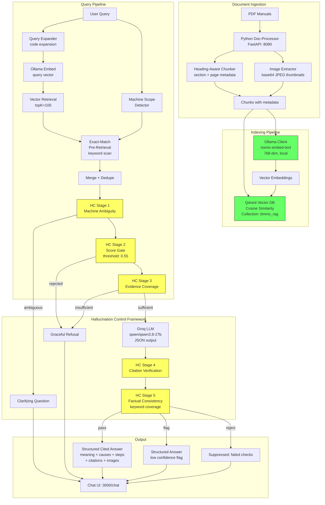

# FaultFinder — RAG Architecture

## System Overview

## Pipeline Stages

### 1. Document Processing (Python FastAPI, port 8080)
- **PDF parsing**: PyMuPDF for text extraction with structural fidelity
- **Section detection**: Heading-aware regex to identify section boundaries
- **Image extraction**: Up to 3 largest embedded images per page, extracted as base64 JPEG (70% quality, max 500 KB each)
- **Chunking**: Heading-aware splitter that preserves section boundaries, with `_split_long` fallback for dense/tabular pages. Max chunk 1800 chars, 120-char overlap. Infinite-loop protection via progress guarantee.

### 2. Embeddings (Local Ollama, port 11434)
- **Model**: `nomic-embed-text` (137M params, 274 MB, 768-dim)
- **Why local**: Zero API cost, no rate limits, runs on M5 Mac Air, surpasses OpenAI `text-embedding-ada-002` on benchmarks
- **Batch**: 96 inputs per request, embedded in parallel

### 3. Vector Store (Qdrant Cloud, 768-dim, Cosine)
- **Collection**: `timmo_rag`
- **Dimensions**: 768 (matching nomic-embed-text)
- **Distance**: Cosine similarity
- **Payload**: Stores document_id, title, page, section, text, char_count, images[]

### 4. Retrieval Strategy
- **Vector retrieval**: topK=100 for broad candidate pool
- **Exact-match pre-retrieval**: Scans all 100 chunks for query terms as regex word-boundary matches. Injects matching chunks at score 1.0. This ensures `b005`, `F012`, `E101` etc. are never missed regardless of vector score.
- **Machine scope filtering**: If query mentions a machine (e.g. "RoboInject-300", "injection molding", "PowerFlex"), filters pool to that machine's documents only.
- **Merge + dedupe**: Exact matches first, then vector hits, deduplicated by document_id + page.

### 5. Hallucination Control Framework (5 Stages)
See [hallucination-control-framework.md](./hallucination-control-framework.md) for full details.

### 6. LLM (Groq, free tier)
- **Model**: `qwen/qwen3.8-27b` (via Groq API, free tier)
- **Temperature**: 0.15
- **Output**: Structured JSON (meaning, causes, corrective steps, citations, confidence, refusals)
- **Context**: Up to 6 conversation turns for follow-up support

### 7. Web Interface (Next.js, port 3000)
- **Landing page**: Product showcase at `/`
- **Chat UI**: ChatGPT-style at `/chat` with structured answer rendering, source citations, and embedded images
- **API routes**: `POST /api/chat` (RAG query), `POST /api/ingest` (PDF upload)

## Tech Stack
| Layer | Technology | Cost |
|---|---|---|
| Frontend | Next.js 16, React 19, Tailwind CSS 4 | Free |
| Backend | Next.js API routes | Free (Vercel) |
| Doc Processing | Python FastAPI, PyMuPDF | Free |
| Embeddings | Ollama + nomic-embed-text (local) | Free |
| Vector DB | Qdrant Cloud | Free tier |
| LLM | Groq (qwen/qwen3.8-27b) | Free tier |
| Monorepo | pnpm workspaces | — |